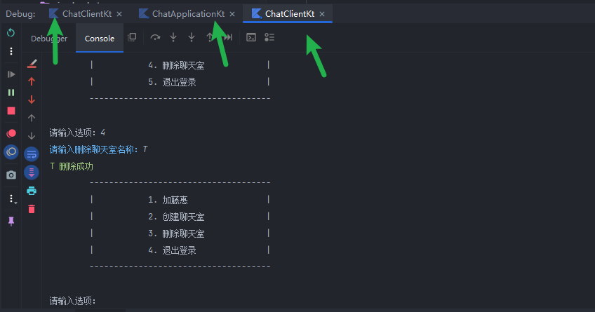

# 简易聊天室

## 功能

1. 登录注册功能
2. 聊天室创建删除功能
3. 聊天室群聊功能
4. 群聊解散功能

## 使用

[ChatClient](./src/main/kotlin/com/silvergravel/chat/client/ChatClient.kt) 启动

[ChatApplication](./src/main/kotlin/com/silvergravel/chat/server/ChatApplication.kt) 启动

输入：`#EXIT_CHAT_ROOM`退出聊天室

## 不足

- 布局排版问题;
- 架构设计不足，功能拓展性可能会差;
- 代码部分冗余以及没有注释
- 没有做过多的错误处理，如Scanner 输入格式不匹配报错问题

权当练习Kotlin,后续有时间再优化...